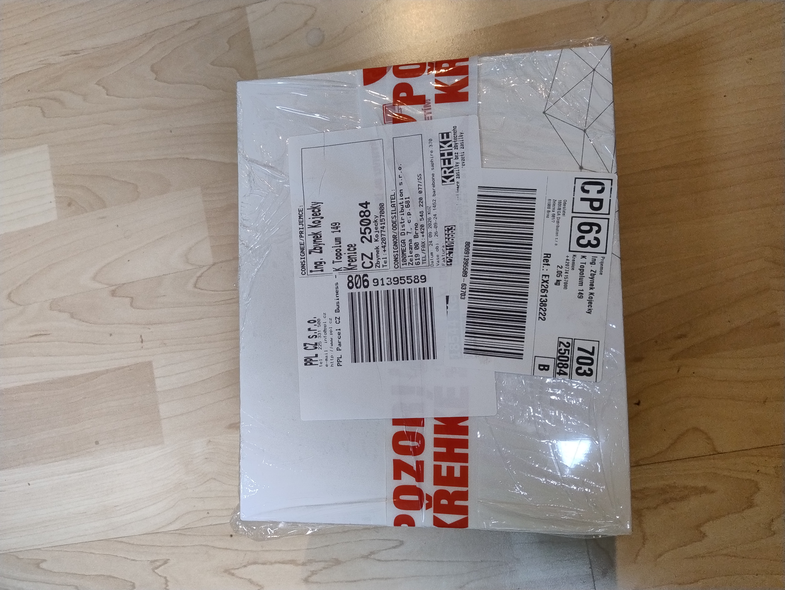
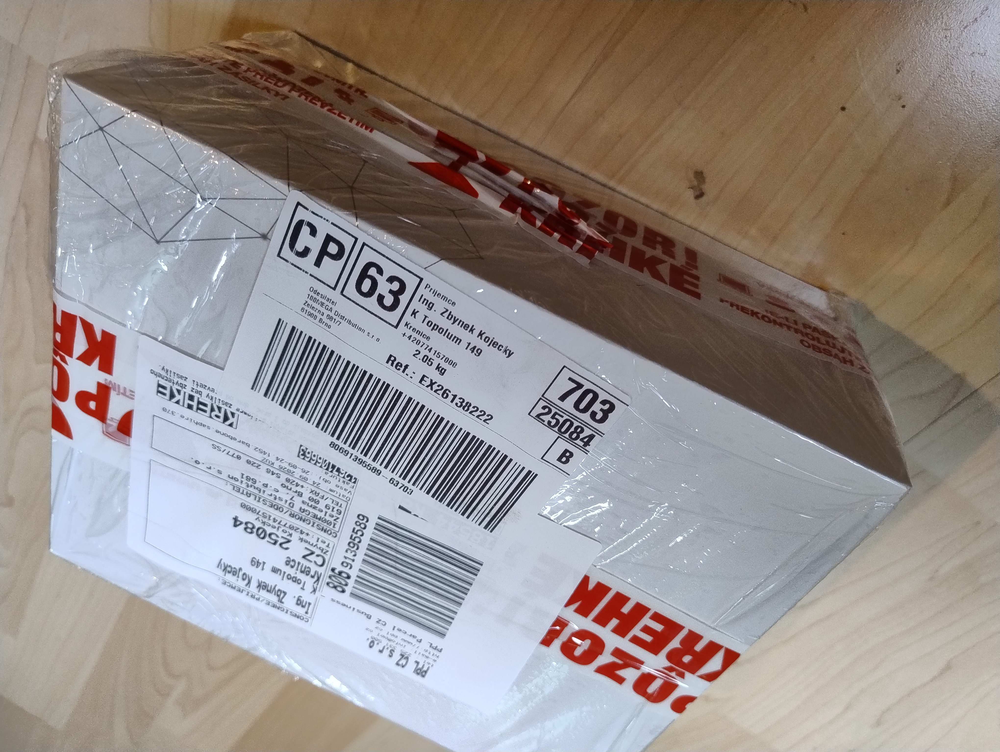
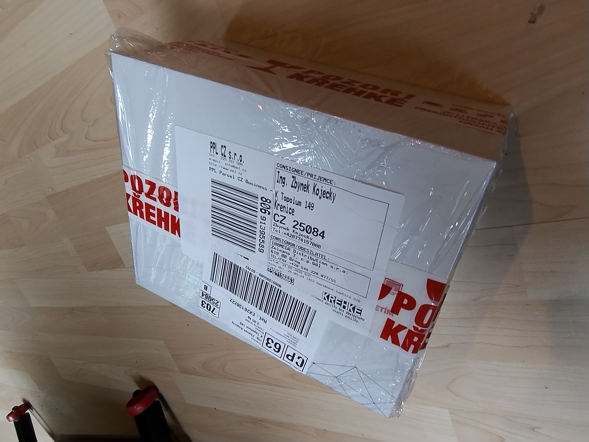
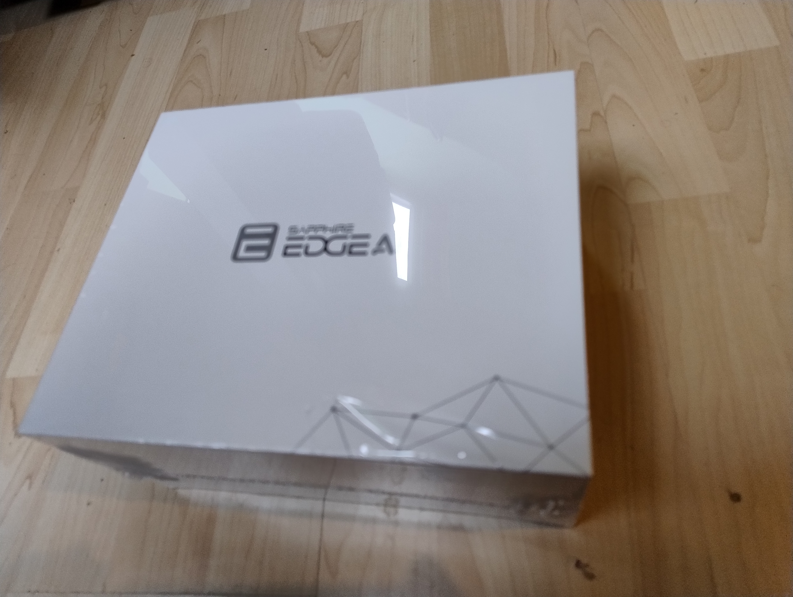
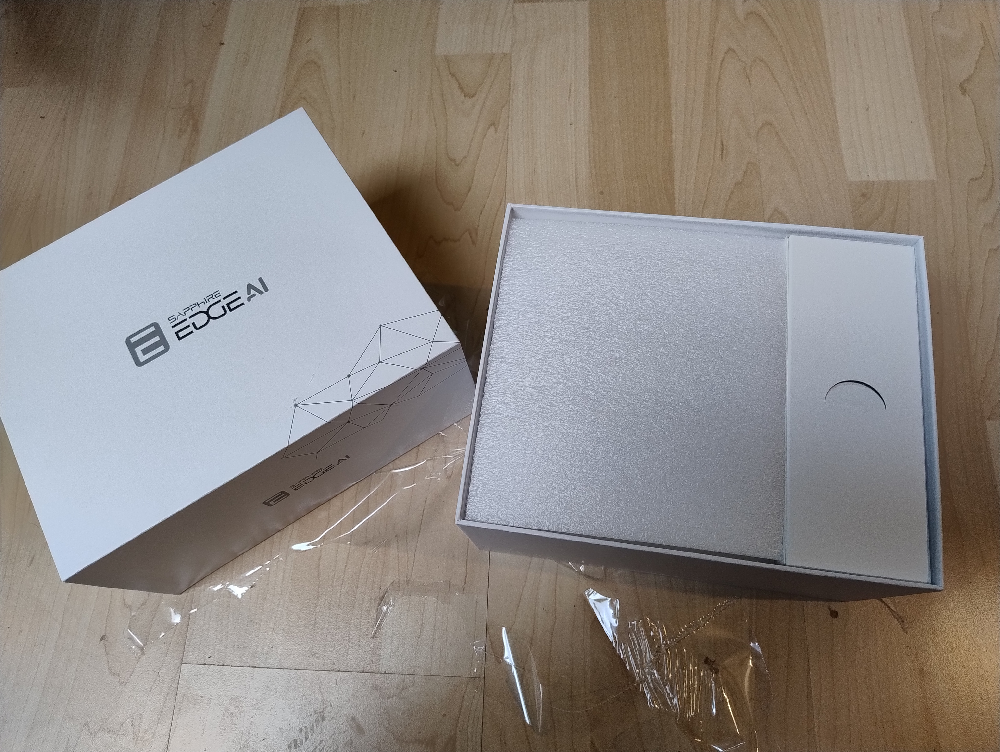
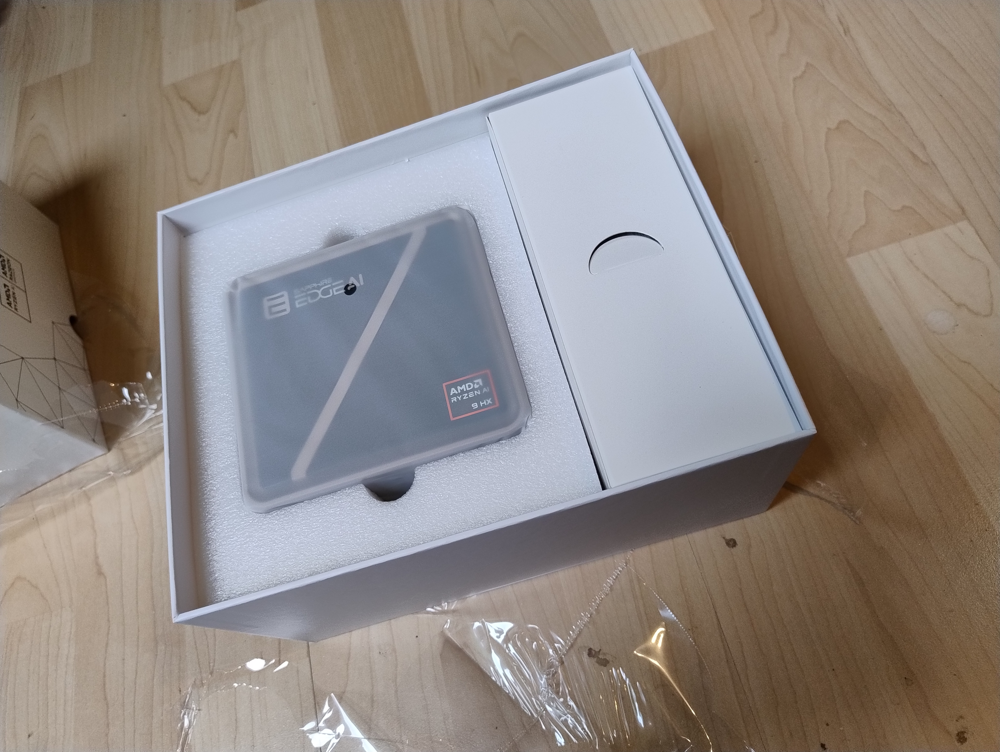
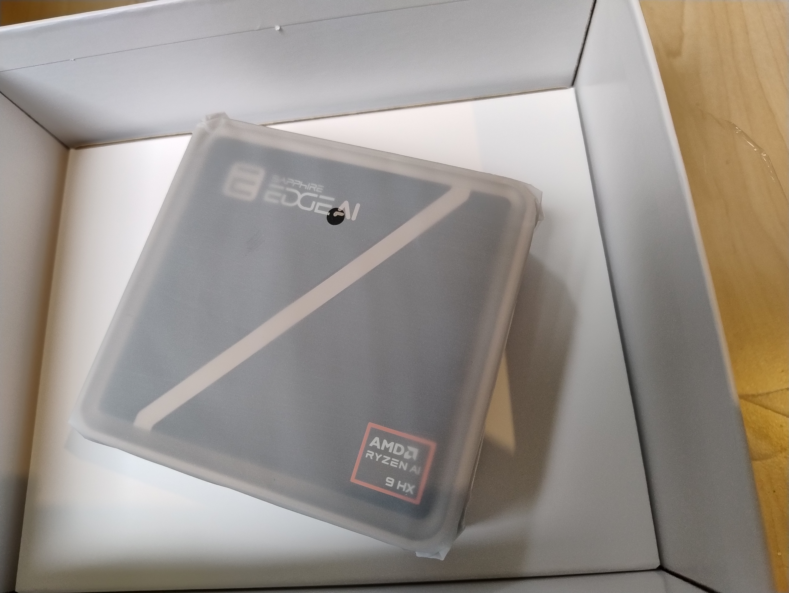
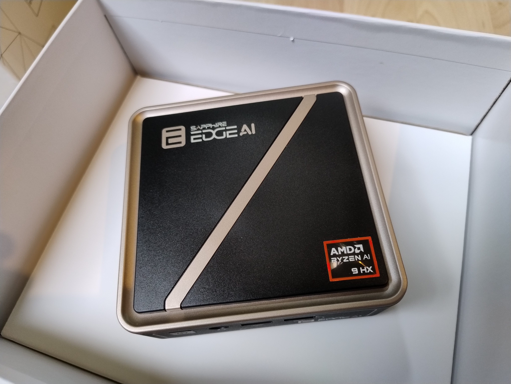
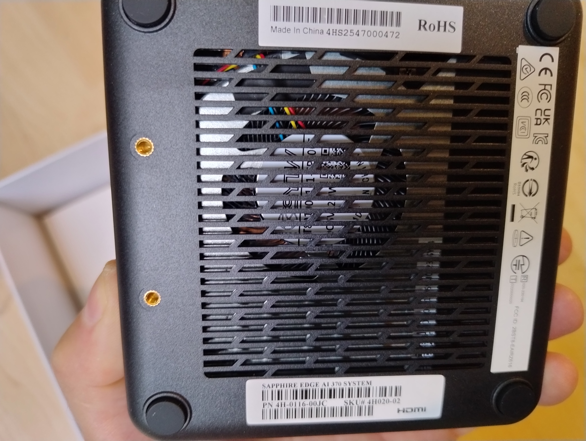
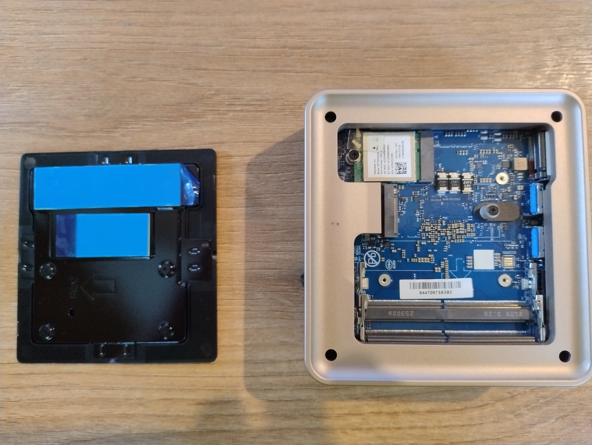

# SAPPHIRE Edge AI 370 — unboxing (analýza fotek)

Rozbalení stroje [SAPPHIRE Edge AI 370](../SAPPHIRE_EdgeAI_370/26-09-23.2315_prehled-a-nezavisle-recenze.md) doručeného 2026-09-25 (objednávka EO26140931 z 24. 9.). 9 fotek pořízených 12:31–12:37. Přejmenováno dle fmt.m (časy = reálné časy pořízení).

## ✅ Hlavní ověření: přišel správný produkt, nepoškozený

- **Model:** SAPPHIRE EDGE AI 370 SYSTEM, **AMD Ryzen AI 9 HX 370** (odznak na víku i na krabici).
- **SKU# 4H020-02** (spodní štítek) — odpovídá objednanému [PN 4H020-02-40G / kód POCSAP1010](../SAPPHIRE_EdgeAI_370/RAM/26-09-24.1545_SAPPHIRE370_100mega-doporuceni-pameti.md) z 100megy. ✅ **správný kus.**
- **PN:** 4H-0116-00JC · **S/N:** 4HS2547000472 · **Made in China** · **FCC ID:** 2BST8-EAIRZ618 · RoHS/CE.
- **Stav:** maloobchodní krabice **zatavená ve fólii**, stroj v matném ochranném obalu — **nová, nepoškozená.**
- **Barebone** — jak očekáváno (RAM a SSD nejsou součástí, dokupují se).

## Fotky (chronologicky)

### Přeprava
- 
  [01 — PPL štítek shora](26-09-25.1231_SAPPHIRE370-unboxing-01-preprava-PPL-stitek.jpg): PPL, **POZOR KŘEHKÉ** páska, příjemce Ing. Zbyněk Kojecký (Křenice), odesílatel **100MEGA Distribution, Brno**, obj. „26-09-24 1452 barebone.saphire.370", **2,05 kg**.
-  [02 — balík z úhlu](26-09-25.1231_SAPPHIRE370-unboxing-02-preprava-balik-uhel.jpg)
-  [03 — balík na podlaze](26-09-25.1232_SAPPHIRE370-unboxing-03-preprava-balik-podlaha.jpg)

### Maloobchodní krabice
-  [04 — retail krabice, zatavená ve fólii](26-09-25.1233_SAPPHIRE370-unboxing-04-retail-krabice-zatavena.jpg): lesklá bílá, logo SAPPHIRE EDGE AI, geometrický vzor.
-  [05 — otevřená, víko vedle](26-09-25.1234_SAPPHIRE370-unboxing-05-krabice-otevrena-vicko.jpg): pěnový insert + **boční přihrádka na příslušenství** (s výřezem pro prst).

### Stroj
-  [06 — mini-PC v matném obalu v krabici](26-09-25.1235_SAPPHIRE370-unboxing-06-minipc-v-obalu-v-krabici.jpg)
-  [07 — detail horní strany v obalu](26-09-25.1235_SAPPHIRE370-unboxing-07-minipc-detail-obal.jpg): logo + odznak **AMD RYZEN AI 9 HX**.
-  [08 — vybalený, horní víko](26-09-25.1237_SAPPHIRE370-unboxing-08-minipc-horni-strana.jpg): černé matné víko s **béžovo-zlatým diagonálním pruhem**, kovový rámeček; vpředu vidět hrana s porty.
-  [09 — spodní strana + štítky](26-09-25.1237_SAPPHIRE370-unboxing-09-minipc-spodni-strana-stitky.jpg): velká **větrací mřížka s viditelným ventilátorem** (aktivní chlazení), gumové nožičky, mosazné závity (VESA/šrouby), štítky S/N + SKU + certifikace.

### Vnitřek (po sundání víka, 13:49)
- 
  [10 — vnitřek + spodní strana víka](26-09-25.1349_SAPPHIRE370-unboxing-10-vnitrek-vicko-pady-sodimm-wifi.jpg): magnetické víko sundané. **Zjištění:**
  - 🔵 **Víko má z výroby předlepené thermal pady** (modré s ochrannou fólií) nad pozicemi M.2 slotů → **nákup samostatného padu nejspíš odpadá** (jen sundat modrou fólii před zavřením). Detail v [SSD souboru](../SAPPHIRE_EdgeAI_370/SSD/26-09-24.1803_SAPPHIRE370_SSD-vyber-a-thermal-pad.md).
  - **2× DDR5 SO-DIMM sloty** (prázdné) — připravené pro Corsair kit.
  - **WiFi: MediaTek MT7922** (Wi-Fi 6E + BT), předinstalováno v M.2 2230, 2 antény (Main/Aux), WF MAC 4C:23:38:B8:4B:B9.
  - M.2 2280 + 2242 sloty pro SSD. Na víku šipka **„FRONT"** (orientace při skládání).

## Postřehy z fotek

- **Obal/ochrana:** dvojité balení (přepravní karton + retail krabice), křehké pásky, pěnový insert, přihrádka na příslušenství — solidní ochrana, sedí s prémiovým dojmem značky.
- **Konstrukce sedí s [manuálem](../Owner_Manual_Sapphire_EDGE_AI_300_series_V1_202511.md):** kompaktní tělo (117×111×30 mm), magnetické horní víko, aktivní chlazení (ventilátor vidět skrz spodní mřížku).
- **Příslušenství** (120W adaptér, 4× napájecí kabel, VESA držák dle manuálu) je pravděpodobně v boční přihrádce — na fotkách není samostatně zachyceno.

## Další kroky

1. **Osadit RAM** — [Corsair Vengeance 5200 CL44 64GB kit](../SAPPHIRE_EdgeAI_370/RAM/26-09-24.1539_SAPPHIRE370_srovnani-RAM-vhodnost-Intel-AMD.md) (párovaný kit — manuál chce identické moduly).
2. **Osadit SSD** — M.2 2280 NVMe Gen4 **+ thermal pad** k víku (viz [výběr SSD](../SAPPHIRE_EdgeAI_370/SSD/26-09-24.1803_SAPPHIRE370_SSD-vyber-a-thermal-pad.md)).
3. **Montáž:** magnetické víko, SO-DIMM nenásilit, víko skládat značkou „FRONT" dopředu.
4. **První spuštění** + případně otestovat teploty/výkon a firemní VPN (viz [Check Point na Debianu](../SAPPHIRE_EdgeAI_370/26-09-24.1829_SAPPHIRE370_firemni-VPN-CheckPoint-na-Debianu.md)).
